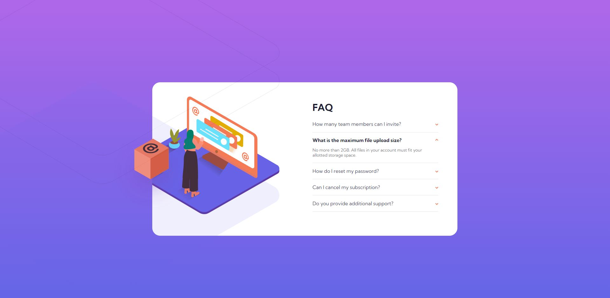

# Frontend Mentor - FAQ accordion card solution

This is a solution to the [FAQ accordion card challenge on Frontend Mentor](https://www.frontendmentor.io/challenges/faq-accordion-card-XlyjD0Oam). Frontend Mentor challenges help you improve your coding skills by building realistic projects. 

## Table of contents

- [Overview](#overview)
  - [The challenge](#the-challenge)
  - [Screenshot](#screenshot)
  - [Links](#links)
  - [Built with](#built-with)
  - [Useful resources](#useful-resources)
- [Author](#author)

## Overview

### The challenge

Users should be able to:

- View the optimal layout for the component depending on their device's screen size
- See hover states for all interactive elements on the page
- Hide/Show the answer to a question when the question is clicked

### Screenshot

### Links

- Solution URL: [Frontend Mentor](https://www.frontendmentor.io/solutions/faq-accordion-card-solution-without-js-qaN8NpajC)
- Live Site URL: [GH pages](https://ezevasari.github.io/faq-accordion-card/)

## My process

### Built with

- Semantic HTML5 markup
- CSS custom properties
- Flexbox
- Mobile-first workflow

### Useful resources

- [CSS Tricks - Quick Reminder that Details/Summary is the Easiest Way Ever to Make an Accordion](https://css-tricks.com/quick-reminder-that-details-summary-is-the-easiest-way-ever-to-make-an-accordion/) - This helped me for accordion without JS. 
- [Tutsplus - Una explicación sobre los elementos “details” y “summary”](https://webdesign.tutsplus.com/es/tutorials/explaining-the-details-and-summary-elements--cms-21999)

## Author

- Linkedin - [Linkedin](https://www.linkedin.com/in/ernesto-vasari-13b366185/)
- Frontend Mentor - [@ezevasari](https://www.frontendmentor.io/profile/EzeVasari)
- Twitter - [@ezevasari](https://www.twitter.com/ezevasari)